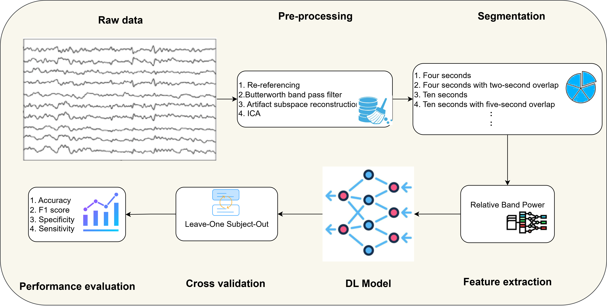

# EEG-based Alzheimer's Disease Detection

This repository presents an AI-driven pipeline for detecting Alzheimer’s Disease (AD) from EEG (Electroencephalogram) signals.
The system integrates data preprocessing, feature extraction, model training, and robust evaluation using Leave-One-Subject-Out (LOSO) cross-validation.

## Overview
This project explores the use of machine learning techniques to analyze EEG signals for early Alzheimer's diagnosis.
- **Dataset:** The study is based on the [**ds004504**](https://www.kaggle.com/datasets/thngdngvn/openneuro-ds004504) dataset from OpenNeuro, which contains EEG recordings relevant to Alzheimer's diagnosis.
- **Data Loading:** Reading EEG datasets.
- **Feature Extraction:** Computing band power and other EEG-related features.
- **Model Training & Evaluation:** Using machine learning/ deep learning models with LOSO cross-validation.
- **Performance Metrics:** Assessing model accuracy and robustness.

## System Architecture

The overall architecture of the proposed EEG-based Alzheimer’s detection pipeline is illustrated below:

## Results

All experiments were conducted under Leave-One-Subject-Out (LOSO) cross-validation on the AHEPA dataset.
Training was implemented in PyTorch using an NVIDIA Tesla T4 GPU, with the following configurations:

*   **Optimizer:** Adam
*   **Learning Rate:** 0.001
*   **Batch Size:** 32
*   **Epochs per fold:** 10
*   **Dropout:** 0.3

### Comparison with Traditional Machine Learning Models

| Model                    | Accuracy (%) | Sensitivity (%) | Specificity (%) | F1-score (%) |
| :----------------------- | :----------- | :-------------- | :-------------- | :----------- |
| KNN (k = 3)              | 67.34        | 59.67           | 76.13           | 70.81        |
| SVM (Polynomial Kernel)  | 70.14        | 62.41           | 75.98           | 68.32        |
| Random Forest            | 72.01        | 72.32           | 71.80           | 71.31        |
| MLP (1 hidden layer, 3 neurons) | 73.12        | 63.00           | 82.73           | 72.82        |
| Proposed CNN–Transformer (ours) | **79.79**    | **80.67**       | **81.06**       | **79.06**    |

### Comparison with Lightweight Deep Learning Baseline

| Model                    | Parameters | Accuracy (%) | F1-score (%) |
| :----------------------- | :--------- | :----------- | :----------- |
| EEGNet4_2 [25]           | 1,066      | 59.82        | 63.49        |
| Proposed CNN–Transformer (ours) | 1,114      | **79.79**    | **79.06**    |

### Segment Length Study

| Segment Configuration    | Accuracy (%) | Sensitivity (%) | Specificity (%) | F1-score (%) |
| :----------------------- | :----------- | :-------------- | :-------------- | :----------- |
| 4 s / 2 s overlap        | 73.40        | 77.34           | 68.64           | 76.08        |
| 10 s / 5 s overlap       | 75.43        | 77.61           | 72.80           | 77.55        |
| 20 s / 10 s overlap      | 76.33        | 81.39           | 70.23           | 79.00        |
| 30 s / 20 s overlap (optimal) | **79.79**    | **80.67**       | **81.06**       | **79.06**    |

### Generalization to Extended Tasks

| Classification Task        | Accuracy (%) | F1-score (%) |
| :------------------------- | :----------- | :----------- |
| (AD + FTD) vs. HC          | 75.60        | 81.44        |
| AD vs. (FTD + HC)          | 64.60        | 60.19        |
| AD vs. FTD vs. HC          | 58.46        | 45.53 (macro F1) |

